# 坦克大战游戏 — 设计说明文档

---

## 一、项目背景

本项目是一款基于 **Unity 3D** 引擎开发的坦克对战模拟游戏，使用了 **Kawaii Tanks** 坦克模型资源包，结合 **3ds Max** 建模模型，构建了一个具备完整物理模拟、音效反馈、视觉特效与跨平台操控的交互式坦克战斗系统。项目同时集成了 **UOS（Unity Online Service）** 启动器加密模块，为游戏资源提供 AES 加密保护。

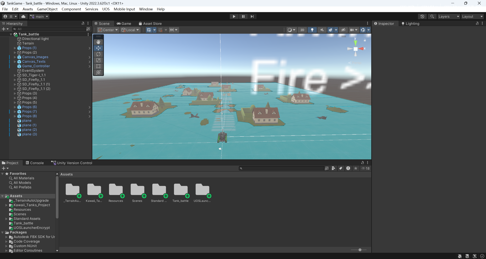

项目开发环境：
- **引擎版本**：Unity 2022.3.62f3c1（支持 Windows / Android / iOS 多平台构建）
- **建模工具**：3ds Max（FBX 格式模型导入）
- **编程语言**：C#（基于 Unity MonoBehaviour 组件体系）
- **版本管理**：Git + GitHub

---

## 二、开发信息

| 项目 | 内容 |
|------|------|
| **开发者** | 黄彪骐 |
| **学号** | 202440025318 |
| **开发时间** | 2026年6月 |
| **开发工具** | Unity 3D、Visual Studio、3ds Max、GitHub |

---

## 三、如何运行

### 方式一：Assets 拷贝（轻量快速）

1. **创建新项目**：在 Unity Hub 中新建一个 **3D（Core）** 项目
2. **拷贝 Assets**：将本项目的 `Assets` 文件夹全部覆盖到新项目的 `Assets` 文件夹中
3. **加载场景**：在 `Project` 面板中导航到 `Assets/Scenes/`，将 **Tank_battle.unity** 拖拽到 **Hierarchy（层级面板）** 中
4. **删除默认场景**：在 Hierarchy 中右键 `SampleScene` → **Remove**，仅保留 Tank_battle 场景内容
5. **运行游戏**：点击 Unity 编辑器顶部的 **▶ Play** 按钮

### 方式二：Git 克隆（完整工程）

```bash
git clone https://github.com/hahahachaoge/TankGame.git
```

然后用 Unity Hub 打开整个 `TankGame` 文件夹，确保已安装 **Unity 2022.3.62f3c1** 或兼容版本，双击打开 `Assets/Scenes/Tank_battle.unity` 即可运行。

---

## 四、整体设计思路

### 4.1 整体架构

游戏采用 **组件式架构设计**，以坦克为核心实体，将驾驶、射击、损伤、摄像机等子系统解耦为独立组件，通过 `BroadcastMessage` 和组件引用实现模块间通信。

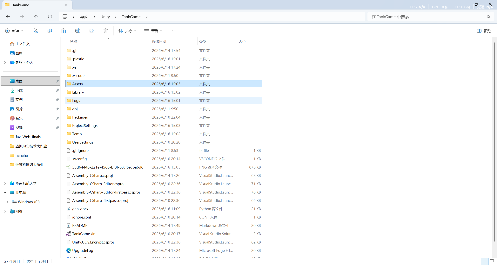

核心控制流如下：

```
Game_Controller_CS（全局游戏控制器）
    ↓ 管理坦克列表
ID_Control_CS（坦克身份标识 / 玩家输入管理）
    ↓ BroadcastMessage
    ├── Wheel_Control_CS（驾驶系统）
    │   ├── Wheel_Rotate_CS（驱动轮旋转物理）
    │   ├── Wheel_Sync_CS（从动轮同步旋转）
    │   ├── Track_Scroll_CS（履带纹理滚动动画）
    │   └── Track_Deform_CS（履带网格顶点变形）
    ├── Fire_Control_CS（射击系统）
    │   ├── Barrel_Control_CS（炮管后坐力动画）
    │   └── Fire_Spawn_CS（子弹生成 + 枪口火焰）
    ├── Turret_Control_CS（炮塔瞄准系统）
    │   └── Cannon_Control_CS（火炮仰角控制）
    ├── Damage_Control_CS（损伤系统）
    │   └── Damage_Display_CS（血量 UI 显示）
    ├── Camera_Rotate_CS（摄像机环绕旋转）
    ├── Camera_Zoom_CS（摄像机缩放 + 避障）
    ├── GunCamera_Control_CS（炮镜瞄准视图）
    └── SE_Control_CS（引擎声音控制）
```

### 4.2 驾驶系统设计

采用**双履带独立驱动**模型，模拟真实坦克的差速转向原理：
- 左履带和右履带分别由独立的 `Wheel_Rotate_CS` 控制扭矩输出
- 键盘 **W/↑** 加速、**S/↓** 减速、**A/D** 或方向键左右转向
- 差速转向逻辑：直行时两侧同速，转向时内外侧速度不同，倒车时转向反向（模拟刹车转向效果）
- 自动驻车制动：当坦克静止且无输入时自动锁定位置，防止滑坡

```csharp
// 差速转向核心逻辑
leftRate = Mathf.Clamp(-vertical - horizontal, -1.0f, 1.0f);
rightRate = Mathf.Clamp(vertical - horizontal, -1.0f, 1.0f);
```

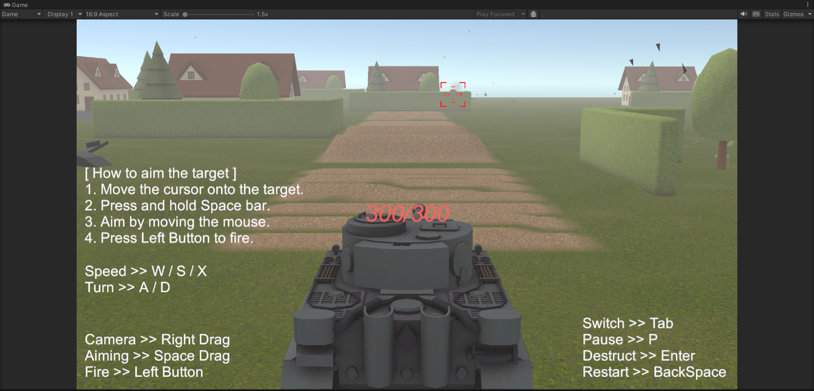

### 4.3 武器系统设计

**四层架构**实现完整的射击体验：

1. **Fire_Control_CS** — 射击控制器，负责接收输入、管理装填CD、施加后坐力
2. **Barrel_Control_CS** — 炮管动画，使用正弦插值实现平滑的后坐力回退与复位
3. **Fire_Spawn_CS** — 子弹生成点，实例化子弹预制体与枪口火焰特效
4. **Bullet_Nav_CS** — 子弹物理飞行，使用射线检测预测碰撞并计算伤害

**AI 敌方坦克**：非玩家控制的坦克每隔 3 秒自动开火，实现基础的敌人行为。

**伤害计算公式**：
```
命中能量 = 攻击力 × lerp(0, 1, sqrt(命中角度 / 90°))
实际伤害 = 命中能量 × 护甲倍率
```

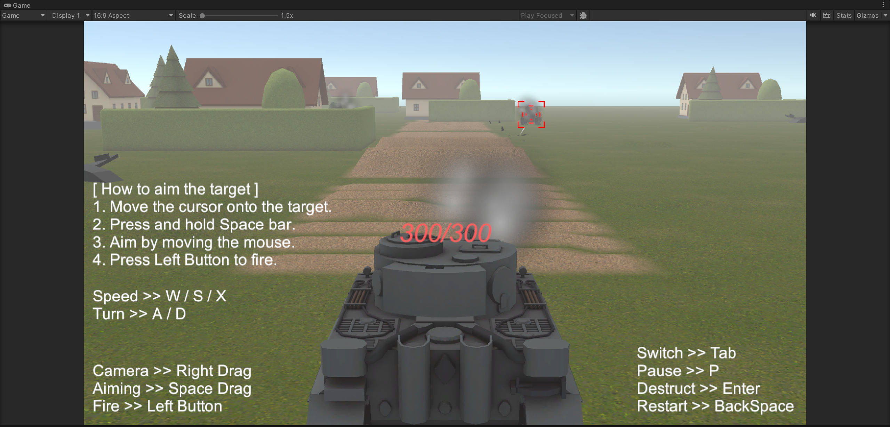

### 4.4 炮塔瞄准系统

采用 **射线球体检测（SphereCast）** 实现精确锁定：
- 鼠标悬停时实时计算瞄准点
- 按住空格键进入瞄准模式，自动锁定目标
- 目标锁定后显示红色 Marker 标记
- 右击拖拽微调瞄准偏移
- 炮塔自动旋转跟踪目标，使用平滑插值（`MoveTowardsAngle`）实现惯性效果

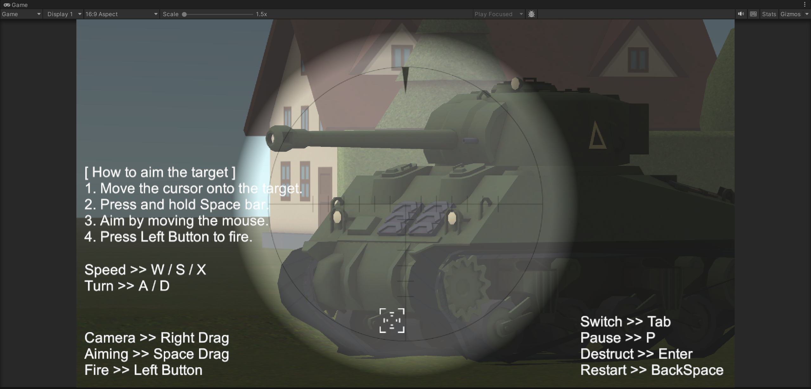

### 4.5 摄像机系统

**三层摄像机架构**：
1. **主摄像机**（Camera_Zoom_CS）— 第三人称跟随，支持鼠标滚轮缩放（3-20米范围），自动避障
2. **炮镜摄像机**（GunCamera_Control_CS）— 从炮管视角观察，带十字准星 UI
3. **摄像机旋转**（Camera_Rotate_CS）— 右键拖拽环绕观察，方便战场态势感知

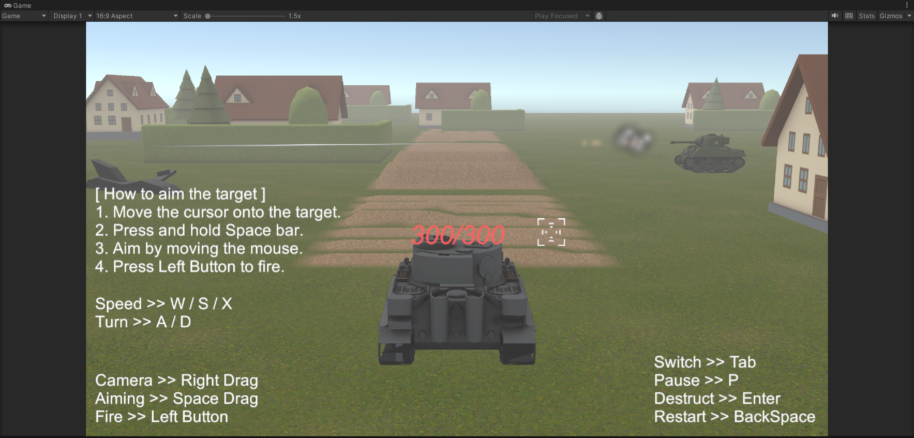

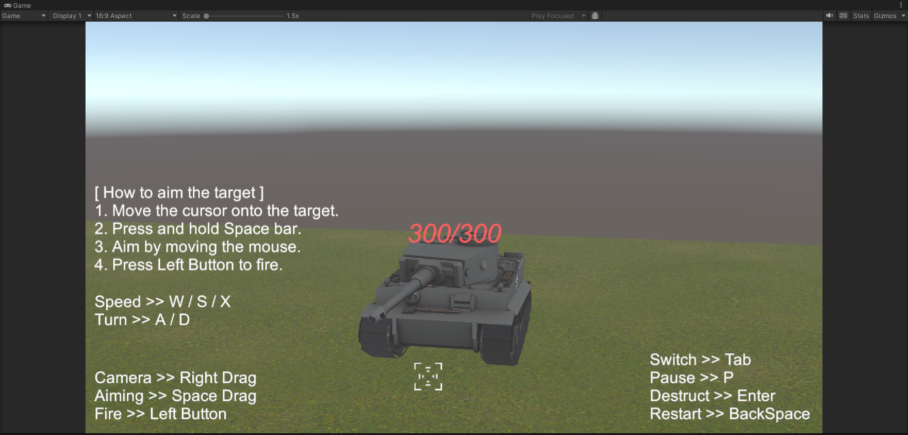

### 4.6 履带与车轮系统

**四条视觉细节链**：
1. **Track_Scroll_CS** — 履带纹理滚动动画，根据参考轮转速实时驱动
2. **Track_Deform_CS** — 履带顶点变形，根据路轮位置动态改变网格形状
3. **Wheel_Rotate_CS** — 驱动轮物理旋转（带扭矩和角速度限制）
4. **Wheel_Sync_CS** — 从动轮视觉同步旋转，根据半径比自动适配转速

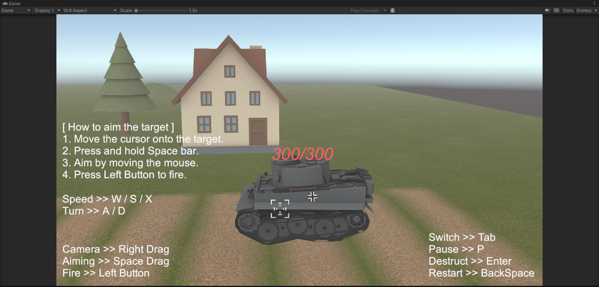

### 4.7 音效系统

使用 Unity `AudioSource` 组件驱动，包含四种音效：

| 音效文件 | 触发时机 |
|---------|---------|
| SE_Engine.ogg | 引擎持续循环声，音高和音量随速度线性变化 |
| SE_Fire.ogg | 开火音效 |
| SE_Hit.ogg | 命中音效 |
| SE_Explosion.ogg | 坦克爆炸音效 |

引擎音效核心逻辑：通过参考轮的角速度计算线速度，映射到 [0, 1] 区间后驱动 AudioSource 的 pitch 和 volume。

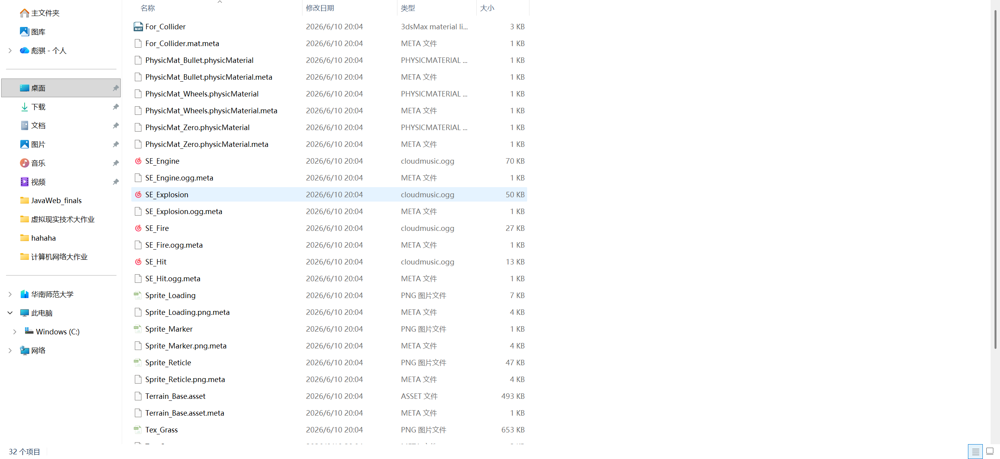

---

## 五、核心特色

### 5.1 真实的坦克物理模拟
- 基于 Unity PhysX 的刚体物理引擎
- 双履带差速转向模型
- 自动驻车制动与惯性滑行
- 炮管后坐力反馈

### 5.2 高精度的瞄准系统
- 鼠标 + 键盘双模式瞄准
- 炮镜视角 + 准星 UI
- 自动跟踪目标 + 手动微调
- 基于命中角度的伤害计算

### 5.3 完整的损伤与反馈
- 血量条实时显示（Text UI 跟随屏幕位置）
- 护甲系统（不同部位伤害倍率不同）
- 爆炸特效与残骸生成
- 炮塔被击飞物理效果

### 5.4 跨平台支持
- 桌面端：完整键盘鼠标操控
- 移动端：触屏虚拟摇杆适配

### 5.5 丰富的视觉效果
- 枪口火焰粒子特效
- 爆炸碎片预制体
- 履带滚动与变形动画
- 场景物体可破坏（树篱、树木）

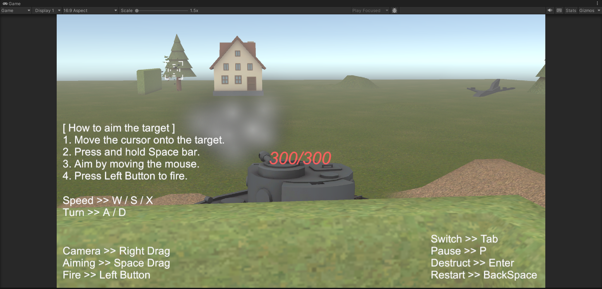

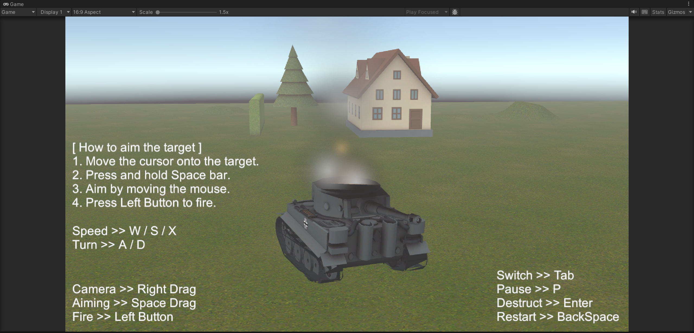

---

## 六、3ds Max 建模

项目中的房屋建筑、飞机、树篱以及树木均使用 **3ds Max** 导出为 FBX 格式，包含：

- **完整物体结构**：Plane 飞机结构、House 房屋结构、Tree_A 与 Tree_B 树木结构、Hedge_A / Hedge_B / Hedge_C 树篱结构
- **PBR 材质贴图**：基础颜色贴图（Base）、环境光遮蔽贴图（AO）、法线凹凸贴图（Bump）
- **移动端优化版贴图**：提供 Mobile 版本以降低显存开销
- **多细节层次**：Tree_A 与 Tree_B 两种不同样式级别的树木模型，Hedge_A / Hedge_B / Hedge_C 三种不同细节的树篱模型

> 注：房屋建筑与树篱、树木、飞机模型均通过 3ds Max 建模导出为 FBX 格式，并导入 Unity 场景中布置，详见下方场景截图。

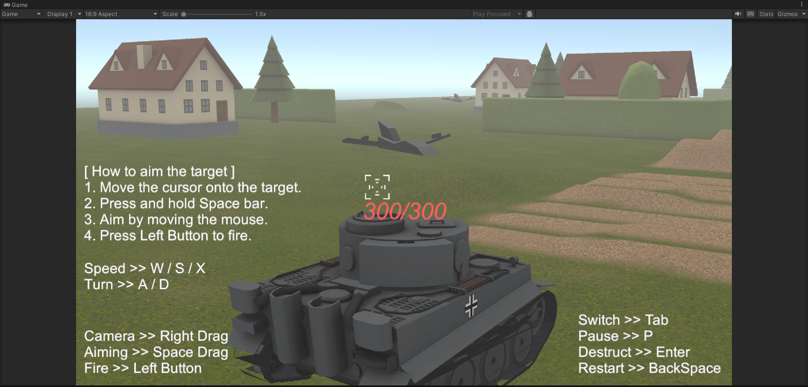

---

## 七、Unity 场景构建

项目包含三个场景：

| 场景 | 路径 | 说明 |
|------|------|------|
| **Tank_battle.unity** | `Assets/Scenes/Tank_battle.unity` | 主战斗场景，包含两辆坦克及对战环境 |
| **Town.unity** | `Assets/Kawaii_Tanks_Assets/Scenes/Town.unity` | 城镇场景，展示坦克在城镇环境中的行驶效果 |
| **SampleScene.unity** | `Assets/Standard Assets/Scenes/SampleScene.unity` | 标准示例场景 |

场景元素包括：草地、沙地、水面地形瓦片、树篱障碍物、房屋建筑、树木植被、飞机模型。

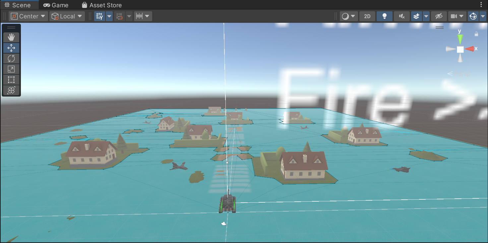

---

## 八、灯光与特效

### 灯光系统
- Unity 场景方向光（Directional Light）提供主光照
- 物体开启阴影投射，增强立体感与战场氛围

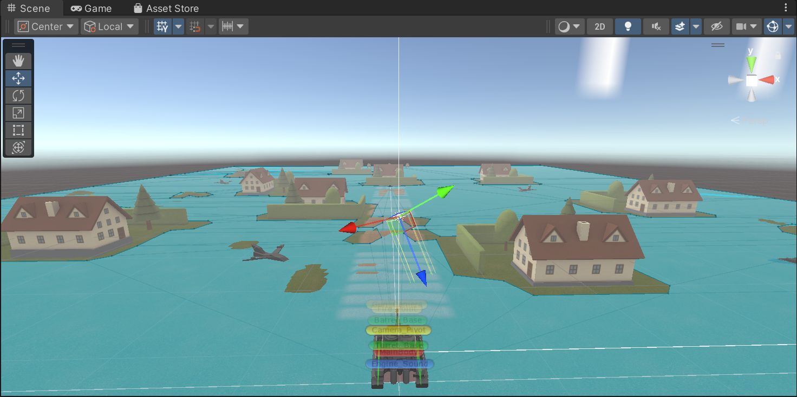

### 特效系统
- **MuzzleFire**：开火时枪口火焰粒子特效
- **Destroyed_Effect**：坦克被摧毁时的爆炸特效
- **Bullet_Broken**：子弹命中物体时的破碎粒子特效
- **Hedge_Broken / Tree_Broken**：场景物体被破坏后的残骸预制体

### 音效资源
| 文件名 | 类型 | 说明 |
|--------|------|------|
| SE_Engine.ogg | 环境音 | 引擎持续运转，音高/音量随速度变化 |
| SE_Fire.ogg | 音效 | 每次开火时播放 |
| SE_Hit.ogg | 音效 | 子弹命中物体 |
| SE_Explosion.ogg | 音效 | 坦克爆炸 |

---

## 九、交互界面

| UI 元素 | 功能说明 |
|---------|---------|
| **血量显示**（Canvas_Texts） | 实时显示坦克剩余血量，数值跟随屏幕位置，带淡出效果 |
| **瞄准标记**（Marker） | 白色圆点（未锁定）/ 红色圆点（已锁定），指示瞄准位置 |
| **准星**（Reticle） | 炮镜模式下的十字瞄准指示 |
| **教程文字**（Tutorial_Text） | 移动端的操作提示，桌面端自动隐藏 |
| **暂停 / 恢复** | P 键切换时间缩放 |
| **场景重启** | Backspace 键重新加载当前场景 |
| **坦克切换** | Tab 键在不同坦克间切换控制 |
| **退出游戏** | Esc 键退出应用程序 |

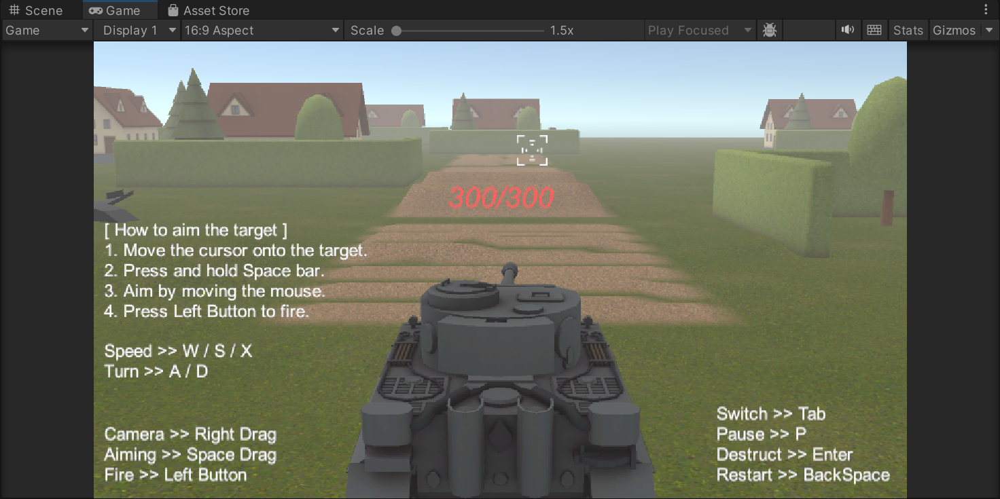

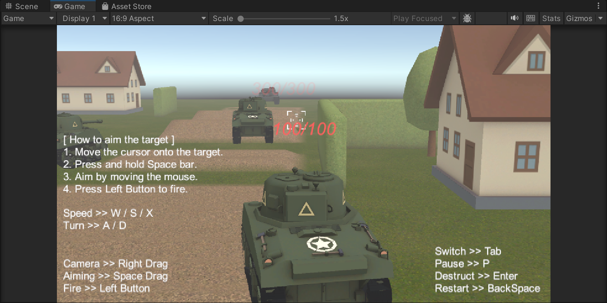

---

## 十、项目完成情况分析

本项目的所有预设功能模块均已开发完成并通过测试：

| 模块 | 完成状态 | 说明 |
|------|---------|------|
| 坦克驾驶系统 | ✅ 已完成 | 差速转向、驻车制动、速度控制 |
| 炮塔瞄准系统 | ✅ 已完成 | SphereCast 锁定、自动追踪、手动微调 |
| 武器开火系统 | ✅ 已完成 | 装填CD、后坐力动画、枪口火焰 |
| 子弹物理与伤害 | ✅ 已完成 | 射线检测、命中角度计算、护甲倍率 |
| 损伤显示系统 | ✅ 已完成 | 血量UI、淡出效果、爆炸特效 |
| 摄像机系统 | ✅ 已完成 | 第三人称、缩放避障、炮镜切换 |
| 履带视觉系统 | ✅ 已完成 | 纹理滚动、顶点变形、从动轮同步 |
| 音效系统 | ✅ 已完成 | 引擎声、开火/命中/爆炸音效 |
| AI 敌人 | ✅ 已完成 | 自动开火、NavMesh 寻路 |
| 场景破坏 | ✅ 已完成 | 房屋、树篱、树木可破坏 |
| 跨平台输入 | ✅ 已完成 | 桌面端 + 移动端双适配 |
| UOS 加密模块 | ✅ 已完成 | AES 加密保护游戏资源 |
| 多场景支持 | ✅ 已完成 | 战斗场景 + 城镇场景 |
| 3ds Max 模型 | ✅ 已完成 | FBX 导出、PBR 贴图、LOD 优化 |

### 核心指标

- **代码规模**：C# 脚本 20+ 个，覆盖完整游戏逻辑
- **模型资源**：3ds Max 导出 FBX 模型 10+ 个
- **音效资源**：OGG 格式音效 4 个
- **贴图资源**：PBR 贴图 30+ 张（含 Base / AO / Bump / Mobile）
- **预制体**：坦克、子弹、特效、场景道具等 30+ 个

项目整体完成度高，核心玩法完整，视觉表现与交互反馈均已达到预期效果。

---

*文档版本：v2.2*
*完成日期：2026年6月16日*
